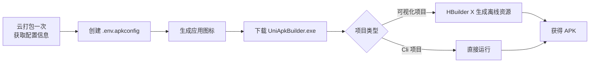

  # 📱 uni-app Android 打包

  
基于离线 SDK 的自动打包服务 —— 一键将 uni-app 项目打包为 Android APK

  <a class="home-card" href="#/guide">
    
🚀

    <h3>快速上手</h3>
    
从配置 `.env.apkconfig` 到生成 APK 的完整流程说明。

  </a>

  <a class="home-card" href="#/guide?id=配置文件">
    
⚙️

    <h3>配置文件</h3>
    
包名、证书、离线 Key 等配置项的获取与填写方法。

  </a>

  <a class="home-card" href="#/guide?id=项目打包">
    
📦

    <h3>项目打包</h3>
    
HBuilder X 可视化项目与 Cli 项目两种打包方式。

  </a>

  <a class="home-card" href="#/guide?id=生成应用图标">
    
🖼️

    <h3>应用图标</h3>
    
打包前如何使用 HBuilder X 生成应用图标文件。

  </a>

## 使用流程概览

> 💡 提示:首次使用前,**必须先进行一次云打包**,这样才有配置文件所需的信息。云端打包所使用的包名就是 APK 的包名,需慎重填写。