# 使用指南

注意：在使用此工具前，需要先进行一次云打包，这样才有配置文件所需的信息

云端打包所使用的包名就是apk的包名，要慎重填写

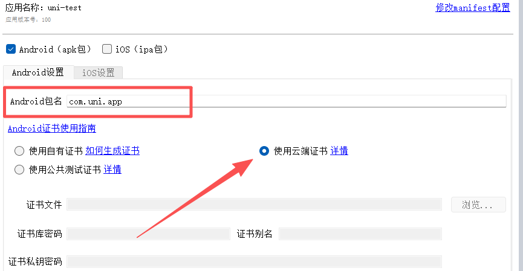

## 1、配置文件

第一次打包时，需要在项目根目录创建配置文件：`.env.apkconfig`

填入以下内容：

```bash
# 主机URL
UB_HOST_URL=http://127.0.0.1:8020
# APP包名
UB_PACKAGE_NAME=com.uni.app
# 证书文件（当前目录的相对路径）
UB_KEYSTORE_FILE=app.keystore
# 证书别名
UB_KEYSTORE_ALIAS=__uni__2704aea
# 证书密码
UB_KEYSTORE_PASSWORD=wlSUfUFZ
# App离线打包Key
UB_DCLOUD_APPKEY=b6d5c4037b09b3ed944f78f0066e3464
```

`UB_HOST_URL` 就是打包服务的基础URL，如果有端口要带上端口

其余的配置要在uni-app开发者后台查看，打开链接：[https://dev.dcloud.net.cn/pages/app/list](https://dev.dcloud.net.cn/pages/app/list)

这里的 `uni-test` 项目是创建的示例，点击**应用名称**进入应用信息页

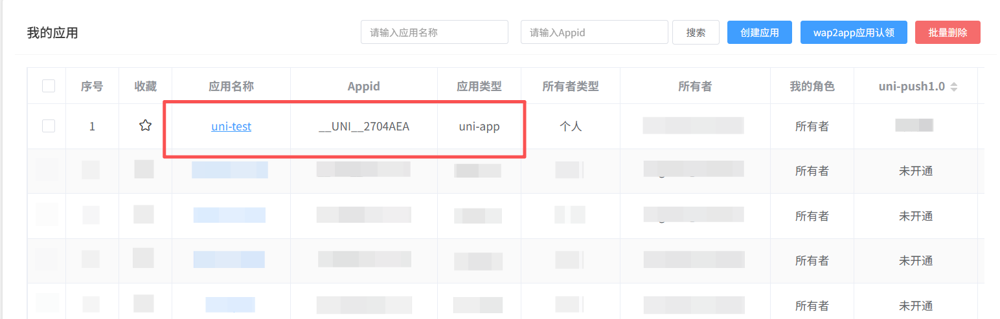

在各平台信息下复制包名，填到配置文件的 `UB_PACKAGE_NAME` 项

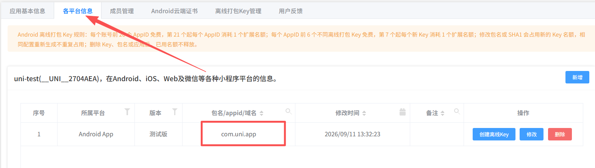

点击右侧的**创建离线Key**按钮来创建离线key

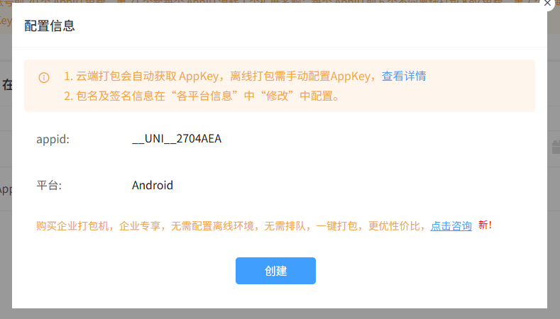

点击**查看离线key**按钮

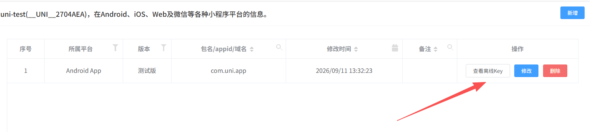

将此内容填入配置文件的 `UB_DCLOUD_APPKEY` 项

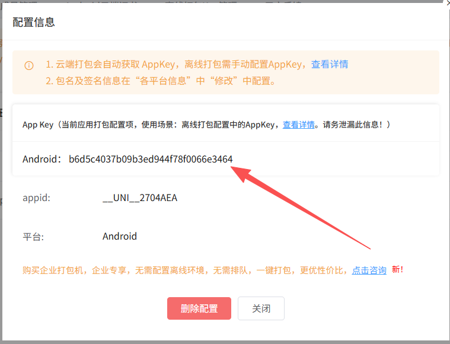

切换到 **Android云端证书** 页，点击**证书详情**按钮

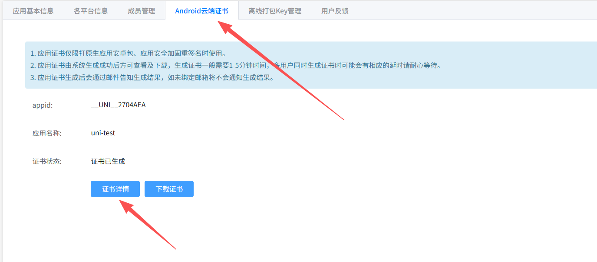

将证书别名填入配置文件的 `UB_KEYSTORE_ALIAS` 项

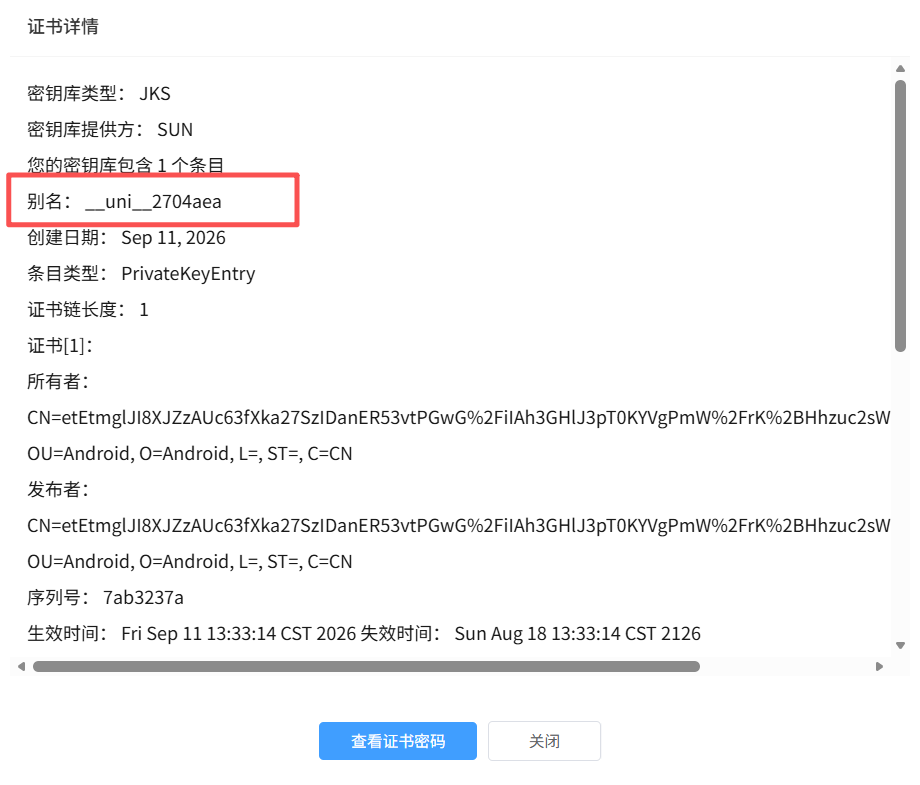

点击查看证书密码，将整数密码填入配置文件的 `UB_KEYSTORE_PASSWORD` 项

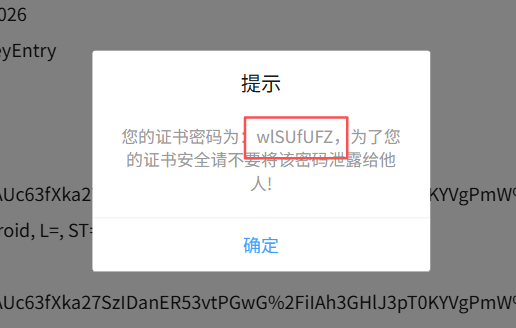

最后点击下载证书，将证书文件放在项目根目录，将证书文件名填入配置文件的 `UB_KEYSTORE_FILE` 项。

> 这里我将证书名重命名为 `app.keystore` 了

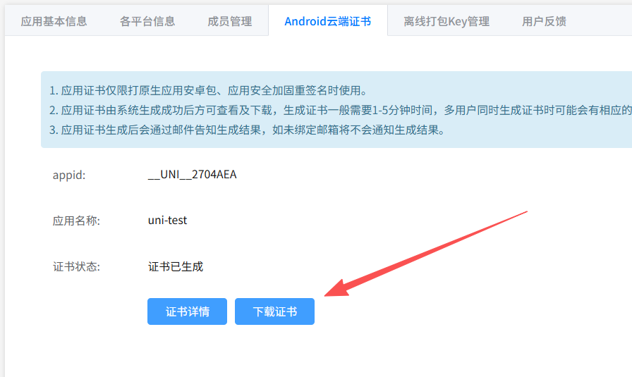


## 2、生成应用图标

在打包前务必确保已经生成了应用图标文件，如果没生成，那么打开 `HBuilder X` ，点击项目的 `manifest.json`  文件，在可视化界面生成应用图标。

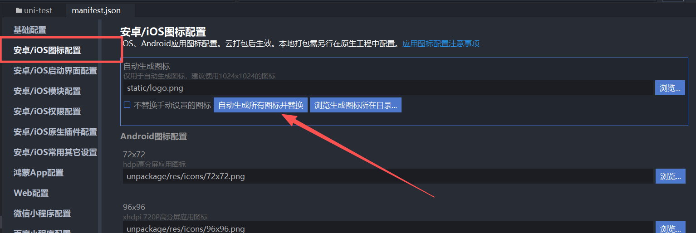

## 3、项目打包

项目打包需要下载打包程序：<a href="/UniApkBuilder.exe" download>UniApkBuilder.exe</a>

将此程序放在项目根目录下，和配置文件在一个文件夹内

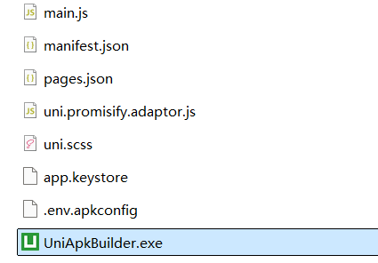

### 3.1、HBuilder X 可视化项目

可视化项目需要在 HBuilder X 上先生成离线打包资源（每次打包前都需要）

点击 `发行` => `App-Android/iOS-本地打包` => `生成本地打包App资源`

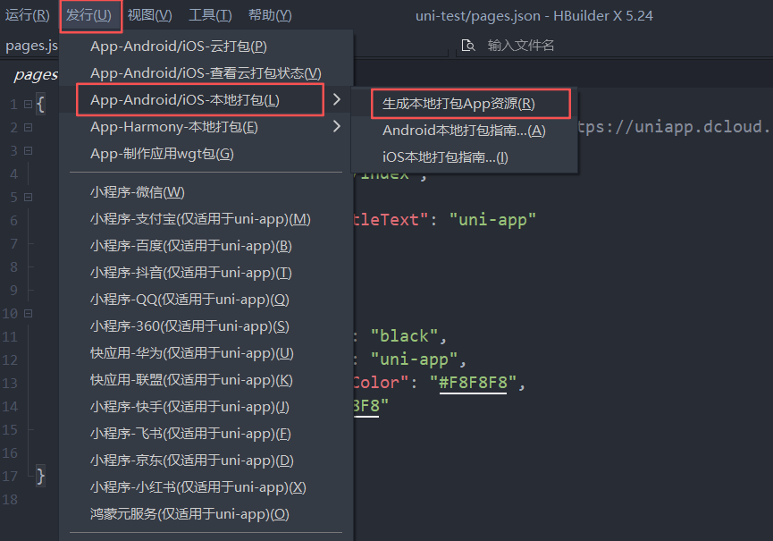

生成资源后直接双击 **UniApkBuilder.exe** 程序，即可开始打包，此时会提示是否生成离线资源

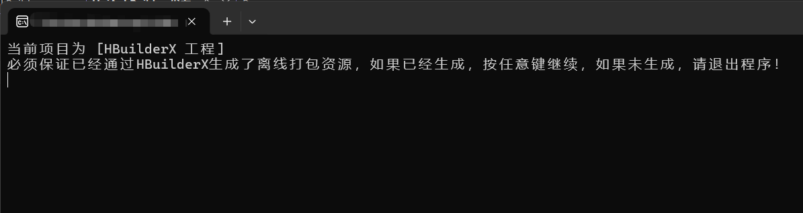

确认无误后按任意键继续

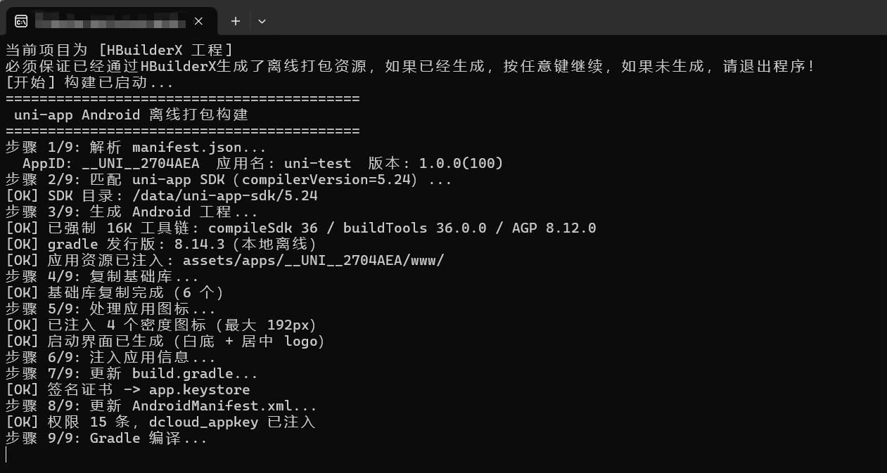

打包后的apk在当前项目的 `unpackage/apk` 路径下

### 3.2、Cli项目

cli的项目比较简单，不需要手动生成离线打包资源，只需要在当前目录双击运行 **UniApkBuilder.exe** 程序即可。

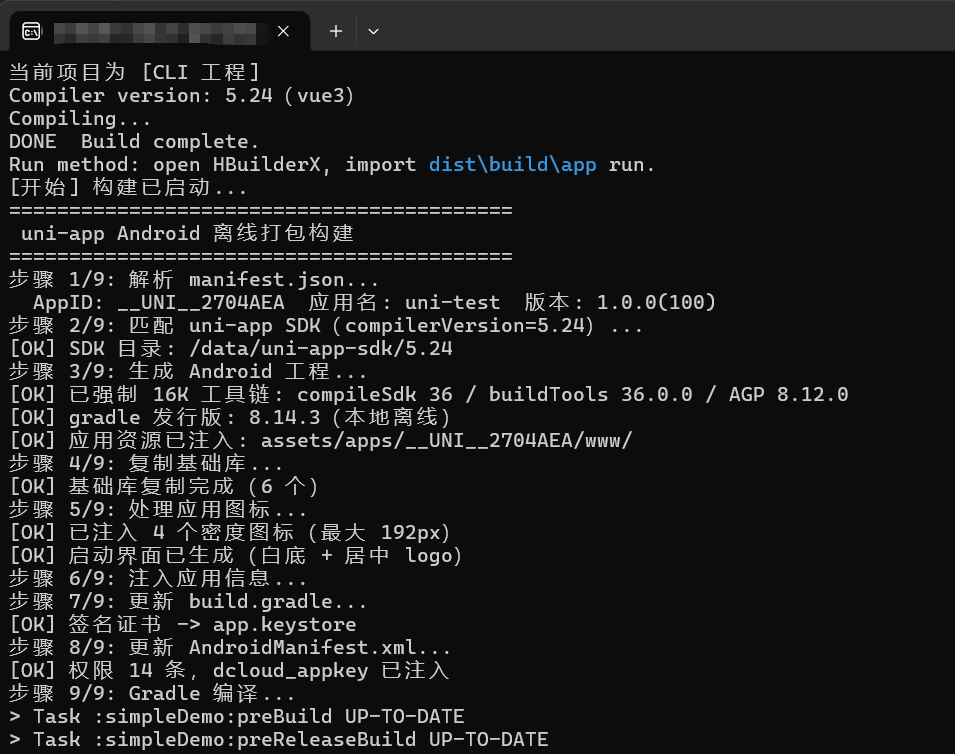

打包后的apk在当前项目的 `dist/apk` 路径下


当然也可以在 `package.json` 的 `scripts` 中直接配置打包脚本

```js
{
  "scripts": {
    "build:apk": "UniApkBuilder --no-wait"
  }
}
```

这时可以运行 `npm run build:apk` 命令进行打包了

## 常见问题

有时候编译可能会报错，这时候注意 `manifest.json` 文件里的 `minSdkVersion` 是否设置的低于21，这里最低不能低于21。